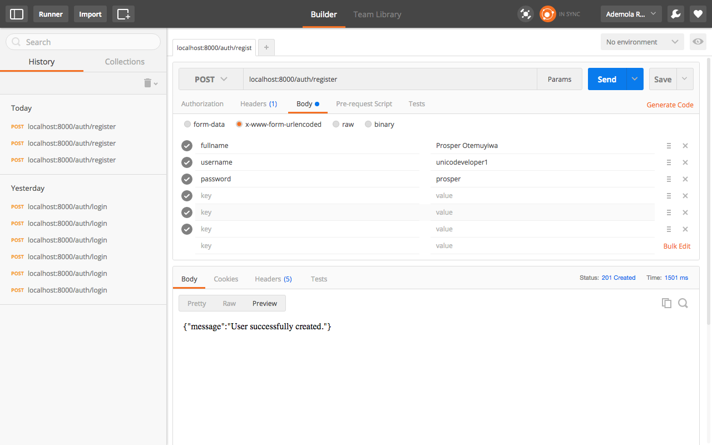
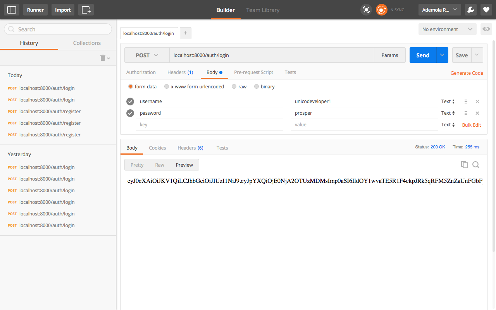
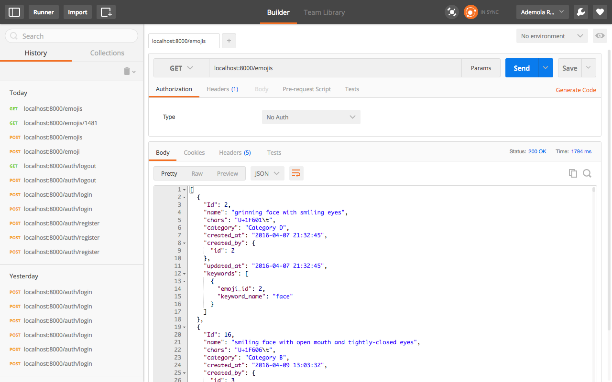
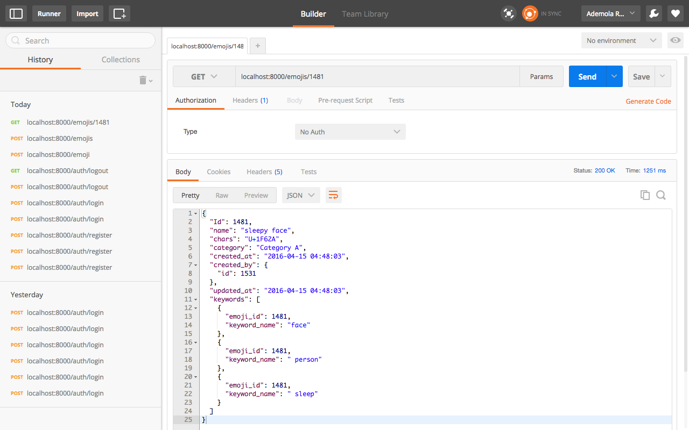
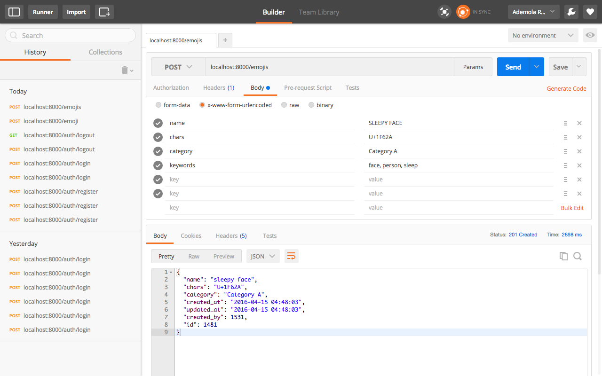
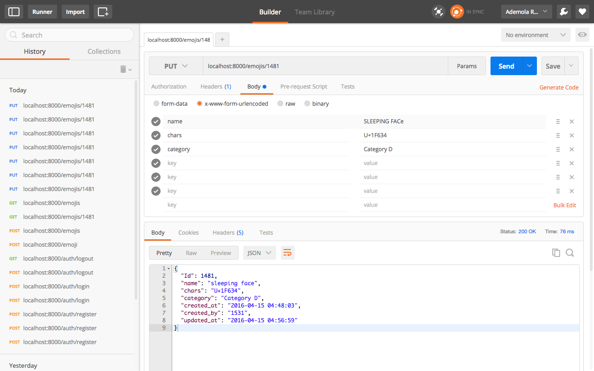
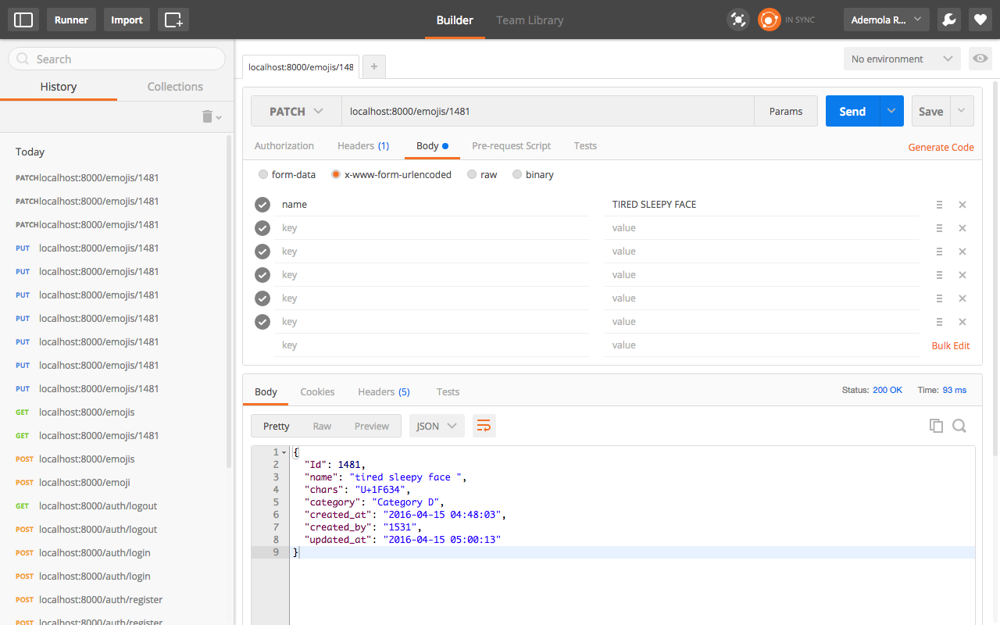
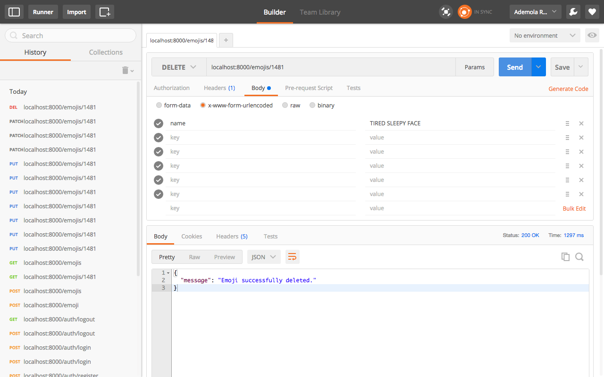

**Emoji REST API**
================
   
----------
This is a simple RESTFul API rendering emoji service to users. It was built with PHP and implements the Slim framework and JSON web token (JWT) for user authentication.

**Installation**
-------
To install this package, PHP 5.5+ and Composer are required

  `$ composer require demola/emoji`

----------
**Usage**
-----
----------
To use this package, You need to set your environment variables. Define your database parameters in your `.env file`

    driver = mysql
    host = 127.0.0.1
    port = port
    username = [Your username]	
    password = [Your password] 
    database  = [Your database]
    
Finally, boot-up the API service with PHP's Built-in web server:

    `$ php -S localhost:8000 -t public`

All examples are shown in [POSTMAN](http://www.getpostman.com/).

----------
**Various Endpoints with their functionality**
-----
----------

- POST /auth/register Create a new user
- POST /auth/login Logs a user in
- GET /auth/logout Logs a user out
- GET /emojis List all the created emojis.
- GET /emojis/{id} Gets a single emoji
- POST /emojis Create a new emoji
- PUT /emojis/{id} Updates an emoji
- PATCH /emojis/{id} Partially updates an emoji
- DELETE /emojis/{id} Deletes a single emoji

Endpoints with access token
---------------------------

- GET /auth/logout Logs a user out
- POST /emojis Create a new emoji
- PUT /emojis/{id} Updates an emoji
- PATCH /emojis/{id} Partially updates an emoji
- DELETE /emojis/{id} Deletes a single emoji

Endpoints without access token
------------------------------

- POST /auth/register create a new user
- POST /auth/login Logs a user in
- GET /emojis List all the created emojis
- GET /emojis/{id} Gets a single emoji

----------
**Registration**
-----
----------
To manage emojis, you'd need to register as a user. The `/auth/register` route handles user registration.

You can register a user using POSTMAN like so:

----------
**Login**
-----
----------

To make use of routes that requires token authentication, you need to get a token. The `/auth/login` route handles token generation for users. You can get token like so:

You can now use the returned token to make other requests to restricted routes.

**Get all emojis**
-------
----------
To get all emojis, send a `GET` request to `/emojis` route like so:

**Get an emoji**
-------
----------
To get an emoji, send a `GET` request to `/emojis/{id of emoji}` route like so:

**Create an emoji**
-------
----------
To create an emoji, send a `POST` request, with your authentication token, to `/emojis` route with emoji's information like so:

**Update an emoji**
-------
----------

To update an emoji, send a `PUT` or `PATCH` request, with your authentication token, to `/emojis/{id of emoji}` route with the information you want to update like so:

for put
-------

for patch
---------

`Note: You can only update an Emoji you created personally.`

**Delete an emoji**
-------
----------
To delete an emoji, send a `DELETE` request, with your authentication token, to `/emojis/{id of emoji}` route like so:

`Note: You can only delete an Emoji you created personally.`

**Testing**
-------
----------

Run the following command in the Emoji directory:

    ~ phpunit

**Change log**
----------

----------

Please check out [CHANGELOG](https://github.com/andela-araimi/Emoji-REST-API/blob/master/CHANGELOG.md) file for information on what has changed recently.

**Contributing**
------------

----------

Please check out [CONTRIBUTING](https://github.com/andela-araimi/Emoji-REST-API/blob/master/CONTRIBUTING.md) file for detailed contribution guidelines.

**Security**
--------

----------
If you discover any issue, kindly contact ademola.raimi@andela.com

**Credits**
-------

----------

Emoji REST API is maintained by Raimi Ademola.

**License**
-------

----------

Emoji REST API is released under the [MIT Licence](https://github.com/andela-araimi/Emoji-REST-API/blob/master/LICENSE.md). See the bundled LICENSE file for more details.