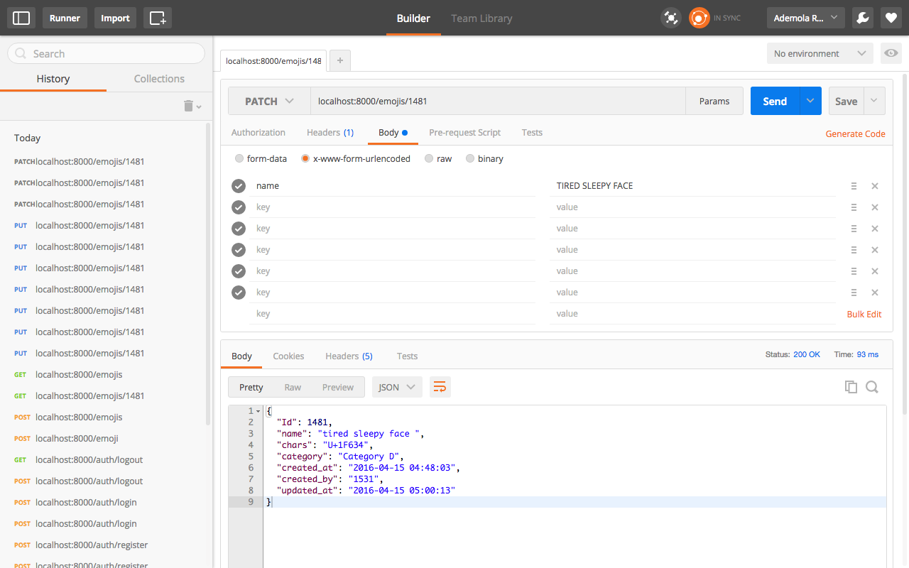

==================

|Coverage Status| |Build Status| |Scrutinizer Code Quality|
-----------------------------------------------------------

This is a simple RESTFul API rendering emoji service to users. It was
built with PHP and implements the Slim framework and JSON web token
(JWT) for user authentication.

**Installation**
----------------

To install this package, PHP 5.5+ and Composer are required

``$ composer require demola/emoji``

+-------------+
| **Usage**   |
+-------------+

--------------

To use this package, You need to set your environment variables to
define your database parameters in your .env file to your local
configuration.

::

    driver = mysql
    host = 127.0.0.1
    port = port
    username = [Your username]  
    password = [Your password] 
    database  = [Your databse ]

Finally, boot-up the API service with PHP’s Built-in web server:

::

    php -S localhost:8080 -t public/

All examples are shown in `POSTMAN`_.

.. _POSTMAN: http://www.getpostman.com/

+--------------------------------------------------+
| **Various Endpoints with their functionality**   |
+--------------------------------------------------+

--------------

-  POST /auth/register Create a new user
-  POST /auth/login Logs a user in
-  GET /auth/logout Logs a user out
-  GET /emojis List all the created emojis.
-  GET /emojis/{id} Gets a single emoji
-  POST /emojis Create a new emoji
-  PUT /emojis/{id} Updates an emoji
-  PATCH /emojis/{id} Partially updates an emoji
-  DELETE /emojis/{id} Deletes a single emoji

Endpoints with access token
---------------------------

-  GET /auth/logout Logs a user out
-  POST /emojis Create a new emoji
-  PUT /emojis/{id} Updates an emoji
-  PATCH /emojis/{id} Partially updates an emoji
-  DELETE /emojis/{id} Deletes a single emoji

Endpoints without access token
------------------------------

POST /auth/register create a new user POST /auth/login Logs a user in
GET /emojis List all the created emojis. GET /emojis/{id} Gets a single
emoji

+--------------------+
| **Registration**   |
+--------------------+

+-----------+
| To manage |
| emojis,   |
| you’d     |
| need to   |
| register  |
| as a      |
| user. The |
| ``/auth/r |
| egister`` |
| route     |
| handles   |
| user      |
| registrat |
| ion.      |
+-----------+
| You can   |
| register  |
| a user    |
| using     |
| POSTMAN   |
| like so:  |
+-----------+
| |User     |
| Registrat |
| ion|      |
+-----------+

**Login**
---------

--------------

To make use of routes that requires token authentication, you need to
get a token. The ``/auth/login`` route handles token generation for
users. You can get token like so:

.. figure:: screenshots/user_login.png
   :alt: User Login

   User Login

You can now use the returned token to make other requests to restricted
routes.

**Get all emojis**
------------------

+-----------+
| To get    |
| all       |
| emojis,   |
| send a    |
| ``GET``   |
| request   |
| to        |
| ``/emojis |
| ``        |
| route     |
| like so:  |
+-----------+
| |Get All  |
| Emojis|   |
+-----------+
| **Get an  |
| emoji**   |
+-----------+

+-----------+
| To get an |
| emoji,    |
| send a    |
| ``GET``   |
| request   |
| to        |
| ``/emojis |
| /{id of e |
| moji}``   |
| route     |
| like so:  |
+-----------+
| |Get      |
| Emoji|    |
+-----------+
| **Create  |
| an        |
| emoji**   |
+-----------+

+-----------+
| To create |
| an emoji, |
| send a    |
| ``POST``  |
| request,  |
| with your |
| authentic |
| ation     |
| token, to |
| ``/emojis |
| ``        |
| route     |
| with      |
| emoji’s   |
| informati |
| on        |
| like so:  |
+-----------+
| |Create   |
| Emoji|    |
+-----------+
| **Update  |
| an        |
| emoji**   |
+-----------+

--------------

To update an emoji, send a ``PUT`` or ``PATCH`` request, with your
authentication token, to ``/emojis/{id of emoji}`` route with the
information you want to update like so:

for put
-------

.. figure:: screenshots/update_with_put.png
   :alt: Update Emoji

   Update Emoji

for patch
---------

   Update Emoji

``Note: You can only update an Emoji you created personally.``

**Delete an emoji**
-------------------

+-----------+
| To delete |
| an emoji, |
| send a    |
| ``DELETE` |
| `         |
| request,  |
| with your |
| authentic |
| ation     |
| token, to |
| ``/emojis |
| /{id of e |
| moji}``   |
| route     |
| like so:  |
+-----------+
| |Delete   |
| Emoji|    |
+-----------+
| ``Note: Y |
| ou can on |
| ly delete |
|  an Emoji |
|  you crea |
| ted perso |
| nally.``  |
+-----------+
| **Testing |
| **        |
+-----------+

--------------

Run the following command in the Emoji directory:

::

    ~ phpunit

**Change log**
--------------

--------------

Please check out `CHANGELOG`_ file for information on what has changed
recently.

**Contributing**
----------------

--------------

Please check out `CONTRIBUTING`_ file for detailed contribution
guidelines.

**Security**
------------

+-----------+
| If you    |
| discover  |
| any       |
| issue,    |
| kindly    |
| contact   |
| ademola.r |
| aimi@ande |
| la.com    |
+-----------+
| **Credits |
| **        |
+-----------+

--------------

Potato-ORM is maintained by Raimi Ademola.

**License**
-----------

--------------

Potato-ORM is released under the `MIT Licence`_. See the bundled LICENSE
file for more details.

.. _CHANGELOG: https://github.com/andela-araimi/Emoji-REST-API/blob/master/CHANGELOG.md
.. _CONTRIBUTING: https://github.com/andela-araimi/Emoji-REST-API/blob/master/CONTRIBUTING.md
.. _MIT Licence: https://github.com/andela-araimi/Emoji-REST-API/blob/master/LICENSE.md

.. |Delete Emoji| image:: screenshots/delete_emoji.png